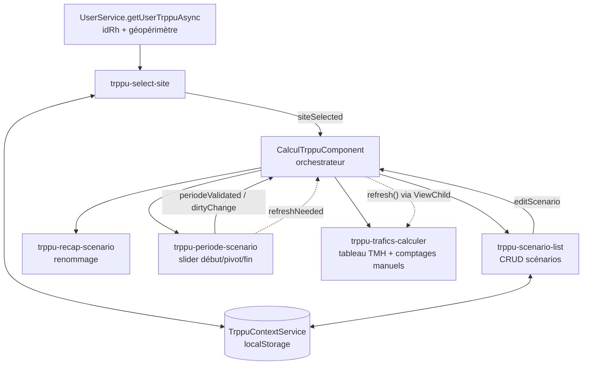

# Étude de compréhension — Module TRPPU

> Module Angular extrait d'un projet plus large (écosystème La Poste / DSR).
> Objet : calcul du **TRPPU** (trafic moyen par produit) d'un site postal, via des **scénarios** paramétrables.
> Date de l'étude : 15/07/2026

---

## 1. Vue d'ensemble

Le module permet à un utilisateur (identifié par son `id_rh`, authentifié via OIDC/APIM) de :

1. **Sélectionner un site** de son géopérimètre (code Regate / code ROC).
2. **Créer / dupliquer / gérer des scénarios** de calcul rattachés à ce site (cycle de vie : `EN COURS → VALIDE → EN PRODUCTION`, archivage soft-delete, gel `est_fige`).
3. **Définir une période** d'analyse (début / fin / date pivot = date de mise en œuvre) via un slider à 3 curseurs.
4. **Calculer les trafics** par produit (CO, IP, OO, OS, PPI, PR, TT) : volumes constatés (réalisé) + prévisionnels de part et d'autre de la date pivot, moyennes journalières et hebdomadaires (TMH).
5. **Ajuster le calcul** : comptages manuels, exclusion de produits, neutralisation de périodes (jours fériés, événements), variations prévisionnelles en %, coefficients de rétention PIC.

Le front dialogue avec un **micro-service TRPPU** (`environment.trppuApiUrl`, proxifié sous `/trppu-api`) et ponctuellement avec un **proxy Orgate** (`environment.orgateProxyUrl`) pour les jours fériés.

---

## 2. Structure du module

```
trppu/
├── trppu.module.ts               # NgModule : déclarations + interceptor HTTP loader
├── trppu-routing.module.ts      # Routes enfants (lazy-loadable)
├── trpp.component.*              # Coquille : <router-outlet> seul
│
├── calcul-trppu/                 # PAGE  /calculate  (page principale)
├── parameters/                   # PAGE  /parameters (neutralisations + variations)
├── configpic/                    # PAGE  /config-pic (coefficients PIC)
├── geoperimetre/                 # PAGE  /geoperimetre (quasi vide, affiche rôles)
│
├── components/                   # Composants de présentation / métier
│   ├── trppu-select-site/        # Autocomplete site du géopérimètre
│   ├── trppu-scenario-list/      # Tableau des scénarios + CRUD
│   ├── trppu-recap-scenario/     # En-tête scénario (renommage inline)
│   ├── trppu-periode-scenario/   # Slider 3 curseurs (début / pivot DMO / fin)
│   ├── trppu-trafics-calculer/   # Tableau des trafics calculés (TMH) + comptages
│   ├── trppu-periode-neutraliser/# CRUD neutralisations (jours ouvrés, fériés)
│   ├── trppu-variation-previsionnelle/ # Sliders -100% / +100% par produit
│   ├── trppu-comptage/           # Saisie de comptages manuels (semble supplanté)
│   ├── trppu-variation-trafic/   # ← mock JSON, commenté dans parameters.html
│   ├── trppu-neutralisation-peak/       # ← mock JSON, commenté
│   ├── trppu-neutralisation-secondaire/ # ← mock JSON, commenté (copie de peak)
│   ├── trppu-produit-a-exclure/  # ← mock JSON, commenté
│   └── trppu-loadder/            # Loader par route + LoaderService + Interceptor
│
├── services/                     # Accès API + état
└── models/                       # Interfaces TypeScript
```

### Routes

| Route | Composant | Rôle |
|---|---|---|
| `''` → redirect `calculate` | `TrppComponent` | Coquille avec breadcrumbs |
| `/calculate` | `CalculTrppuComponent` | Écran principal de calcul |
| `/parameters` | `ParametersComponent` | Neutralisations & variations |
| `/config-pic` | `ConfigpicComponent` | Grille des coefficients PIC |
| `/geoperimetre` | `GeoperimetreComponent` | Périmètre utilisateur (embryonnaire) |

---

## 3. Services

| Service | Backend | Rôle |
|---|---|---|
| `ScenarioService` | `{trppuApiUrl}/scenarios` | **Cœur du module.** CRUD scénarios, machine à états (`statut`, `est_fige`, mise en prod, duplication), TMH (list/upsert/patch volume/exclusion/delete), comptages, variations. Contient aussi `normalizeTraficsResponse` (agrégation des lignes manuelles par produit). |
| `TraficService` | `{trppuApiUrl}/trafics` | `get_trafics` (déprécié) et `get_trafics_pivot` : volumes réalisé/prévisionnel autour de la date pivot + nb jours ouvrables. Porte les formules `calculateMoyenneJournaliere` / `calculateMoyenneHebdo`. Liste blanche produits : `CO, IP, OO, OS, PPI, PR, TT`. |
| `VariationPrevisionnelleService` | `{trppuApiUrl}/scenarios/{id}/variations` | Upsert d'une variation % par produit (`variation_pct = 0` ⇒ suppression back). Tickets DSR-646 / DSR-651. |
| `ComptageService` | `{trppuApiUrl}/produits` | Référentiel produits (une seule méthode `listProduit`). |
| `PicCoefficientService` | `{trppuApiUrl}/scenarios/{id}/pic-coefficients` | Coefficients PIC par (produit, jour, densité). GET = défaut national fusionné avec les surcharges scénario (DSR-660) ; PUT = enregistrement d'un coefficient modifié avec `id_rh` (DSR-661). Mapping jours IHM (`LUN`…) ↔ API (`LUNDI`…) et `id_session_ihm` transmis en query param. |
| `ParamService` | **Aucun (mocks)** | Charge des JSON statiques `assets/trppu/*-{siteId}.json`. Utilisé uniquement par les 4 composants commentés de `parameters`. |
| `TrppuContextService` | localStorage | Contexte transverse : `trppu.id_scenario`, `trppu.co_regate`, `trppu.id_session` (UUID de traçage). Permet de restaurer site + scénario au rechargement. |
| `LoaderService` + `LoaderInterceptor` | — | Compteur de requêtes `/trppu-api` **par route** ; le composant `TrppuLoadderComponent` affiche un spinner pour la route active. **Actuellement désactivé** (composant commenté dans le module et dans `trpp.component.html`, seul l'interceptor est enregistré). |

### Endpoints consommés (micro-service TRPPU)

```
GET/POST        /scenarios                         (filtres co_regate, statut, est_fige…)
GET/PUT/DELETE  /scenarios/{id}
PATCH           /scenarios/{id}/periodes | nb-jours-semaine | statut | est-fige | lb-scenario
POST            /scenarios/{id}/mise-en-prod | duplicate
GET/PUT         /scenarios/{id}/tmh        PATCH/DELETE /tmh/{id_tmh} (+ /exclusion)
GET/POST        /scenarios/{id}/comptages  PUT/DELETE   /comptages/{co_produit}
GET             /scenarios/{id}/variations PUT/DELETE   /variations/{co_produit}
GET/POST/DELETE /scenarios/{id}/neutralisations        (appelé en direct via HttpClient dans le composant !)
GET             /trafics/get_trafics_pivot             (co_regate, date_debut, date_fin, date_pivot → format YYYYMMDD)
GET             /produits
POST            {orgateProxyUrl}  { url: apiPaths.getFerierDays }   (jours fériés)
```

---

## 4. Flux de données de l'écran principal (`/calculate`)



Déroulé type :

1. `trppu-select-site` charge le géopérimètre de l'utilisateur, restaure le site depuis le localStorage, enrichit le site via `getSiteDataByRegate`.
2. `trppu-scenario-list` liste les scénarios du site (`co_regate`), restaure le scénario en cours, permet créer (nom auto `LIBELLE-DDMMYYYY`) / supprimer (soft-delete) / éditer.
3. `trppu-periode-scenario` : slider custom (drag natif mouse/touch, snap au jour, écart max 2 ans, fenêtre d'affichage flexible selon la durée, notifications). « Valider » ⇒ `PUT /scenarios/{id}` puis émet `periodeValidated`.
4. Le changement de `dateDebut/dateFin/datePivot` déclenche dans `trppu-trafics-calculer` la chaîne :
   `get_trafics_pivot` (retry ×2, modal « traitement long » après 30 s) → `upsertTmh` (persistance) → `refresh()` → `listTmh` (relecture + agrégation des comptages manuels par produit).
5. L'utilisateur peut exclure un produit (PATCH exclusion), ajouter/modifier/supprimer un comptage manuel (upsert TMH avec `manuel: true`), changer 5/6 jours par semaine (PATCH `nb-jours-semaine` + recalcul des moyennes).

**Formules clés** (dans `TraficService`) :
- Moyenne journalière = `round((volume_réalisé + volume_prévisionnel) / nb_jours_ouvrables)`
- Moyenne hebdo (TMH) = `round(jours_semaine × (volume_réalisé + volume_prévisionnel) / nb_jours_ouvrables)`

---

## 5. Les autres écrans

### `/parameters`
- **Actif** : `trppu-periode-neutraliser` (CRUD neutralisations avec calcul local des jours ouvrés hors fériés/week-ends, saisie fluide avec enchaînement de focus et sauvegarde au blur, gestion 409/422) + `trppu-variation-previsionnelle` (sliders −100/+100 %, pas de 5, upsert au changement).
- **Commenté / mock** : `variation-trafic`, `neutralisation-peak`, `neutralisation-secondaire` (copies quasi identiques), `produit-a-exclure` — tous branchés sur `ParamService` (JSON statiques). Le bouton « Valider les paramètres » ne fait qu'un `console.log` du payload consolidé.

### `/config-pic`
Grille produits × (jour × densité : dense / clairsemée / clairsemée2, samedi = densité unique). Édition inline avec états visuels (pending = rouge, propre au scénario = vert si `id_pic_version ≠ 1`), validation 0–100, sauvegarde au blur. **Entièrement simulé côté front** (localStorage) en attendant le back YS04. Ligne de total = moyenne (placeholder, RG à définir avec le métier).

### `/geoperimetre`
Squelette : expose `user` et `roles` du `UserService`, sans logique.

---

## 6. Dépendances externes au module

Le module n'est **pas autonome** — il importe depuis l'application hôte :

| Import | Usage |
|---|---|
| `../../../service/user/user.service` (`UserService`, `DSRUser`) | idRh, géopérimètre, données site |
| `../../../model/site.model` | `Site` (codeRegate, codeRoc, dex, libellés…) |
| `../../../shared/dialog/confirm-dialog` & `message-dialog` | Modales de confirmation / message |
| `../../external.module` (`ExternalModule`) | Vraisemblablement Angular Material + modules partagés |
| `../../../literals/api-paths.literal` | URL jours fériés |
| `../../../../environments/environment` | `trppuApiUrl`, `orgateProxyUrl` |
| `@cddng/auth-oidc-apim` | Authentification OIDC (injecté mais peu utilisé dans `calcul-trppu`) |
| `@angular-slider/ngx-slider`, `MatExpansion`, `MatAutocomplete` | UI |

---

## 7. Points d'attention / pistes d'amélioration

Constats issus de la lecture, classés par impact — base de travail pour la phase d'amélioration.

### Bugs potentiels / robustesse
1. **Tableaux utilisés comme dictionnaires** : `const trafics = []` indexé par des clés string (`trafics[key]`) dans `TraficService.normalizeTraficsPivotResponse` et `ScenarioService.normalizeTraficsResponse`, puis `Object.values(...)`. Ça fonctionne mais crée des tableaux à trous, casse `length`, et rend le code fragile → utiliser `Map` ou `Record<string, T>`.
2. **`trppu-comptage.onRemove`** supprime seulement localement (jamais `deleteComptage` côté back) — incohérence avec `onAdd` qui persiste.
3. **`recap-scenario.saveName`** : `replace(' ', '_')` ne remplace que le premier espace (le commentaire dans le code le signale lui-même) ; même défaut dans `scenario-list.onAdd`.
4. **Gestion des abonnements** : aucun `unsubscribe`/`takeUntil` ; risques de fuites et de réponses croisées (ex. changement rapide de site pendant un `get_trafics_pivot` long).
5. **`calcul-trppu.html`** référence des outputs inexistants (`periodeChange` sur `trppu-periode-scenario`, `periodeValidated` sur `trppu-trafics-calculer`) — silencieusement ignorés.
6. **Événements dans `complete:`** : plusieurs flux (`loadScenarios`, `loadTraficsScenario`…) mettent la logique de suite dans `complete` plutôt que `next`, ce qui la rend dépendante du contrat de complétion de l'observable HTTP.
7. `utilisateurConnecter` peut être `undefined` si un upsert TMH part avant la réponse de `getUserTrppuAsync` (accès direct à `.idRh`).

### Dette technique / nettoyage
8. **Code mort et commenté** : `TrppuLoadderComponent` (déclaration commentée mais interceptor actif), `loadTrafics()` déprécié, 4 composants de `parameters` commentés, nombreux blocs commentés (sessionStorage, orgateProxy) et `console.log` de debug partout.
9. **Duplication** : `neutralisation-peak` ≡ `neutralisation-secondaire` (copier-coller intégral) ; interfaces `VariationUpsert`/`VariationUpsertResult` définies deux fois (scenario.service et variation-previsionnelle.service) ; helpers `ymd`/`toDateStr`/`formatDateFr` répétés dans 3+ composants ; `openMessage`/`openError` recopiés.
10. **Typage faible** : profusion de `[key: string]: any` dans les DTOs de `ScenarioService` (`ScenarioCreate`, `ComptageCreate`, `VariationOut`…), casts `(scenario as any)`, double convention `id`/`id_scenario` et `periode`/`periode_debut` dans le modèle `Scenario`.
11. **Appels HTTP directs dans un composant** : `trppu-periode-neutraliser` construit ses URLs et appelle `HttpClient` lui-même → à extraire dans un `NeutralisationService`.
12. **Mocks à brancher** : `ParamService` (assets JSON) attend son backend. (`PicCoefficientService` est désormais branché sur le vrai back YS04 — DSR-660/661.)
13. **Nommage** : `trpp.component` vs `trppu`, `trppu-loadder` (loader), `utilisateurConnecter`, mélange français/anglais dans le code et les APIs.
14. **Indentation incohérente** (1 espace dans plusieurs fichiers, 2 dans d'autres) et fichier parasite `trppu-periode-scenario.component.txt`.
15. **Tests** : seulement 3 `.spec.ts` génériques (« should create ») ; la logique riche (slider de période, normalisations, calculs de moyennes, jours ouvrés) n'est pas testée alors qu'elle s'y prête très bien.

### Architecture (pour l'amélioration)
16. **État transverse** : le contexte (site/scénario sélectionnés) transite à la fois par `TrppuContextService` (localStorage brut, non réactif) et par des chaînes d'`@Input/@Output` + `ViewChild`. Un état observable centralisé (service à `BehaviorSubject`, ou signals/NgRx selon la version d'Angular cible) simplifierait `CalculTrppuComponent` et supprimerait les rechargements croisés.
17. **`ScenarioService` obèse** : mélange CRUD scénario, TMH, comptages, variations et logique de normalisation métier → découper par ressource.
18. Le pattern « valider la période → recalcul pivot → upsert → relecture » est piloté par des `ngOnChanges` en cascade ; le rendre explicite (une méthode/un effet unique) réduirait les appels involontaires.

---

## 8. Glossaire

| Terme | Signification |
|---|---|
| **TRPPU** | Indicateur de trafic moyen par produit calculé pour un site (l'objet du module) |
| **TMH** | Trafic Moyen Hebdomadaire (ligne de calcul par produit) |
| **Date pivot / DMO** | Date de mise en œuvre : sépare le réalisé (avant) du prévisionnel (après) |
| **Code Regate / ROC** | Identifiants d'un site postal ; **DEX** : direction exécutive (groupe de sites) |
| **PIC** | Plateforme Industrielle Courrier — coefficients de rétention par produit/jour/densité |
| **Neutralisation** | Période exclue du calcul (grève, travaux…), en jours ouvrés hors fériés |
| **Comptage manuel** | Volume saisi à la main pour un produit, ajouté au constaté |
| **Produits** | CO (colis), IP, OO, OS, PPI/PP, PR (presse), TT |
| **id_rh** | Identifiant RH de l'utilisateur, tracé dans chaque écriture |
| **DSR-xxx** | Références des tickets Jira du projet (646, 651, 660, 661…) |
